# 비언어 특성 중심 EBS 강의 영상 분석

빅데이터 4기 3조 미뇽논버벌
 임유하(조장), 김민수, 이형석, 전혁선, 이찬녕(초기 참여)
  

## Time Frame
2023.11.20. ~ 2024.01.02
  

## 요약
이 프로젝트에서는 인기 강의, 비인기 강의의 차이점을 분석하고, 이를 바탕으로 효과적인 학습 강의를 제공하기 위해 인터넷 강의 분석 웹 서비스를 구축했다. 이 서비스는 사용자가 업로드한 영상을 분석하여 얼굴 표정, 안면 윤곽, 랜드마크 포인트, 손의 위치 등을 추출하고 시각화함으로써, 강의의 품질과 효과를 비교 분석한다. 

이를 통해 사용자는 자신의 강의와 인기 강의 간의 차이를 쉽게 이해하고, 영상에서 추출한 목소리를 텍스트로 변환하여 현 교육과정 성취기준과 유사도를 비교하는 피드백을 제공한다. 
  

## 목적
천재교육 인터넷 강의 플랫폼 밀크티는 현재 초등교육부터 고등교육까지 모든 학년의 인터넷 강의를 유료로 제공하고 있다. 하지만 초등교육 대비 중등, 고등 과정의 강의는 타 인터넷 강의 플랫폼 대비 비교적 적은 이용자 수를 가지고 있다. 

이번 프로젝트로 구축한 강의 분석 시스템을 밀크티 내 강의에 적용한다면, 인터넷 강의 퀄리티 향상을 목적으로 인기강좌, 비인기강좌의 비언어적 특징을 찾아 사용자가 올리는 강의와의 비교분석을 통해 얻은 피드백으로 강의 품질 향상을 기대할 수 있다.
  

## 역할 분담

  

## 기능
### User
| Action | Description |
| --- | --- |
| 동영상 업로드 | 업로드 탭을 만들어 사용자의 영상을 입력 받음 |
| 재생 | 업로드한 영상을 재생할 수 있게 하여, 자신이 올린 영상이 맞는지 확인하게 하기 위함 |  
|영상 정보 | 영상 정보에 대한 기본적인 메타 데이터들을 확인할 수 있게 함 |

### Developer
| Action | Description |
| --- | --- |
| 웹 | Plotly Dash를 활용한 Web Page 제작 |
| 그래프 | 분석 결과물들을 시각적으로 비교분석 할 수 있는 Plotly 패키지 사용 |
| 데이터베이스 | AWS S3 서비스를 이용하여, 사용자가 업로드한 영상을 저장하고, 추출된 텍스트를 저장하는데 사용  AWS RDS 서비스를 이용하여, 분석한 결과에 대한 데이터를 저장하고 실시간 처리되는 비언어 Feature를 적재하는데 사용 |
| 모델링 | AWS ECR 서비스를 이용하여, Docker Image를 push하여 Lambda로 구동 |
| 서버 | AWS ECS 서비스를 이용하여, 사용자로 부터 받은 동영상 처리 및 웹 서버 배포 |
  

### Mock Up 

EBS 강의를 인기/비인기 영상으로 나누어 비언어적 특징에 중점을 두고 분석하여 나온
결과값을 RDS에 저장하여 비교 데이터로 만든다. 

Plotly Dash를 활용하여 사용자가 강의 동영상을 업로드 시, 분석 결과를 제공하고 RDS에 저장되어 있는 비교 데이터를 가져와 각 결과값을 비교, 검증할 수 있는 웹페이지를 구축한다.
  

### AWS Architecture

  

## Modeling
### Face Detection and Mesh

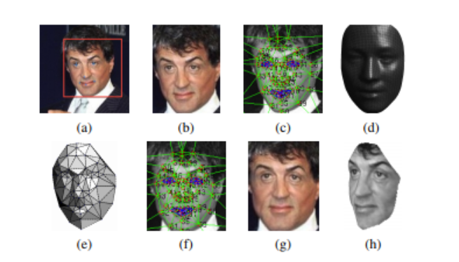

CNN 구조에 사진을 넣기 전 2D alignment 와 3D alignment를 거쳐서 사진이 정면을 바라 보도록 해주고 (h)와 같이 새로운 측면에서의 데이터 수집했다. 얼굴 이미지 내에서 변화를 제거하여 모든 얼굴이 카메라를 응시하는 것 처럼 보이도록 수정(2D alignment) 했다. 
2D 정렬은 이차원에서 변화를 정규화 시켜줄 수 있게 해주지만 평면 이외에 편차는 정규화 할 수 없으므로 3D로 변환(3D alignment)해 준다.

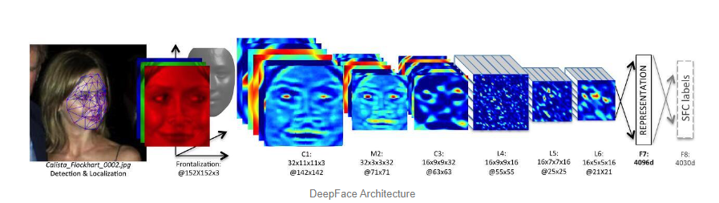

앞서 설명한 모든 과정을 mediapipe를 통해 모델로 Face Mesh 모델로 사용 가능

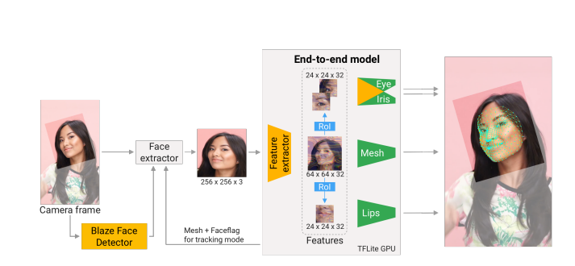 

영상 강의 총 프레임과 face landmark 검출되는 프레임 수를 확인하여 영상 내에서 검출되는 확률 확인

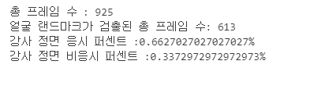

옆 모습을 얼굴로 인식하는 문제점이 발생했는데

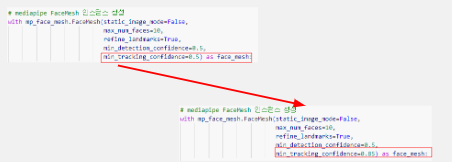
 
min tracking confidence는 얼굴 추적을 위한 최소 신뢰도로 0.5에서 0.85로 수정함으로써 모델을 튜닝할 수 있었다.

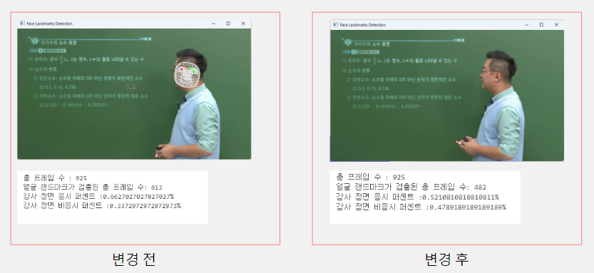
  

### Sentimental

감정 분석 모델 학습

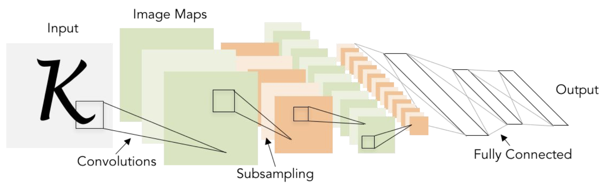
 
- CNN과 VGG 모델을 탐구한 후, 7개의 감정 클래스로 이루어진 fer2013 데이터셋을 사용한 모델학습으로 감정 분석 모델을 제작했다. 
- 관련 모듈 임포트. 데이터셋 로딩 함수 정의. 데이터 분할 등 코드를 작성하고, epoch 10으로 모델학습을 진행했다.
  

감정 분석 모델 선택 : 커스텀 CNN 모델

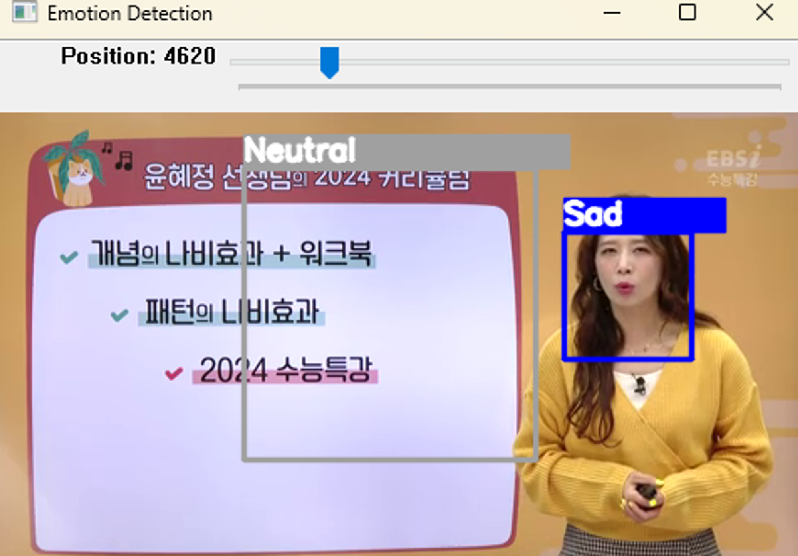
 
- 커스텀 CNN과 VGG로 만든 모델을 각각 감정분석을 실행해보았는데, VGG로 만든 모델 감정분석은 전체 프레임당 영상을 세세하게 분석하기 때문에, 영상인식시간 + 분석시간(총 영상 길이의 2배 시간)이 소요되었다. 
- 또한 VGG 모델은 영상 감정 분석 중, 얼굴이 아닌 위치에서도 감정이 표현되는 오류를 나타내었다.
- 감정 분석 인식 정확도 향상과 분석 처리 속도 향상을 위해 VGG가 아닌 커스텀 CNN 모델을 사용하기로 결정했다.
  

- 각 동영상 파일의 프레임을 읽어들이고, 그레이스케일로 변환한 후에 얼굴을 감지했다. 감지된 얼굴 중 첫번째 얼굴에 대해서만 처리를 진행했다.
- 전체 프레임당 감정분석을 수행시 얼굴의 감정이 지나치게 많이 변하기 때문에 프레임마다 5번의 감정 분석을 수행하여 얼굴의 감정을 추정했다.
- 각 동영상 파일에 대한 감정 분석 결과는 json 파일 형식으로 저장했다.
- 감정 분석 결과가 저장되어 있는 json 파일 형식에서 각 클래스별 감정 표현 결과값을 데이터로 가져와 그래프 형식으로 나타내었다.
  

인기/비인기 강의 감정분석 결과

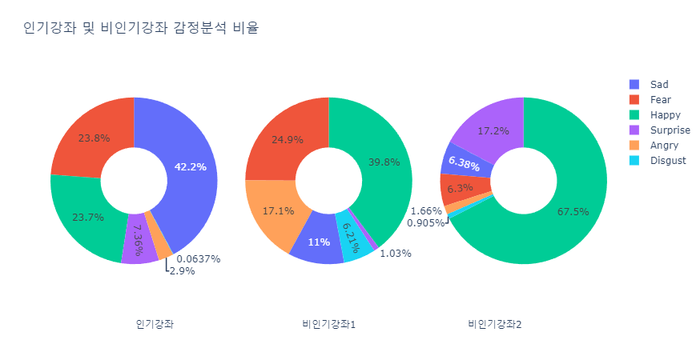

-	인기/비인기 강의로 선정된 3개의 강좌를 위와 같이 커스텀 CNN모델을 사용하여 감정분석을 진행하고 각 결과값을 json파일로 저장했다.
-	json 파일에 저장되어 있는 감정분석 결과값을 각 강의별로 평균을 내고 그래프 형식으로 나타낸 후 비교하였다.
-	비교 결과, 인기 강좌에 비해 비인기 강좌의 Happy 표정 비율이 더 높게 차지하고 있었고, 세 강좌 모두 disgust의 표정 비율이 가장 낮았다.
-	수학 과목의 세 강좌를 비교했을 때는 인기의 지표를 나타내는 유의미한 결과를 나타내지는 않는 것 같아, 인기,비인기의 다른 영상 비교 데이터가 더 필요하고 다른 과목의 인기,비인기 강의도 감정분석할 필요가 있다.
  

### Pose Landmarker
-	'mediapipe'의 'pose_landmarks'를 이용하여 강의 영상을 프레임 단위로 이미지를 가져와 랜드마크의 각 부분(0번 부터 32번 까지)의 x, y좌표(x, y는 -1.0에서 1.0까지 z는 0.0에서 부터 시작되지만 사용하지 않음)를 계산의 편의성과 명확한 수치를 보여주기 위해서 각 영상의 해상도를 각각 곱하여 각 랜드마크 포인트를 키 값으로 x, y좌표를 밸류 값으로하여 json파일을 각 강좌명의 폴더에 강의명으로 저장하였다.
-	저장된 json파일을 불러와서 각 강의의 상반신 랜드마크 포인트 위치로 'heatmap' 그래프로 시각화하였다.
-	각 강사의 강좌의 전체 강의에 대한 'heatmap' 그래프와 각 강의 별 어깨와 손목 사이의 거리의들의 분산과 표준 편차를 구하려고 하였으나 각 각의마다 해상도가 상이하여 동일한 강좌에 대한 히트맵 구현이 불가능 하였고, 해상도에 따라서 분산 값과 표준 편차의 값이 증가 하여 정확한 비교가 불가능하였다.
-	영상 마다 해상도를 가져와서 계산 하는 것이 아닌 밀크티 강의 해상도인 720P을 기준으로 좌표 값들을 저장하는 것으로 수정하였다.
-	RDS (MySQL Community)에 json파일의 데이터를 적재 과정에서 리스트 형태의 밸류값이 적재 되지 않아 해당 리스트를 나눠서 {랜드마크}_{x}의 형식으로 컬럼을 만들고 밸류값으로 해당 좌표의 수치를 적재 하도록 하였으나 데이터 하나를 적재 하는데 코랩에서 평균 3시간의 시간이 소요되었다다.
-	처음 부터 수집되는 json파일을 형태를 RDS에 바로 적재가 가능한 형식으로 x, y로 키를 나누고, 강의 영상의 특성상 하반신이 나오지 않아서 처음부터 상반신의 좌표만 추출하여 저장 하는 것으로 수정하였다.
-	수정된 json파일로 RDS에 적재, 적재 시간은 크게 변하지 않았다.
-	RDS에 있는 데이터를 가져와서 강사별, 교재별, 강의별로 상반신의 히트맵을 시각화 하고, 손 부분만을 히트맵으로 시각화 하면서 해당 히트맵을 시각화 할떄 쓰인 데이터를 기반으로 어깨와 손목 사이의 거리에 대한 분산과 표준 편차를 보여줄 수 있도록 하였다. 
  

### Text Comparison	
특정 과목을 교육할 때 그 과목에 대한 가이드라인이 있을 것이라 판단했다. 그 가이드라인은 ‘국가 교육과정 정보센터’에서 찾을 수 있었고, ‘수학 성취 기준’과 강의 내용은 얼마나 유사한지 비교했다. 

‘수학 성취 기준’에서 수학 학습의 목표와 중학 수학 내용만을 기준으로 했으며, 강의 내용도 방대했기 때문에 두 문서를 GPT API를 활용해 요약 한 후 유클리디안 거리와 코사인 유사도를 활용해 비교했다.

전체 파이프라인은 아래와 같다.

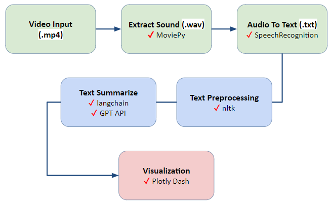

우수 강사의 강좌가 성취 기준과 상대적으로 더 관련 있는 것으로 결과가 나왔습니다. 하지만 비교할 수 있는 대상의 강좌 수가 너무 적기 때문에, 설득력을 높이기 위한 통계적 검증은 시행하지 못했다.
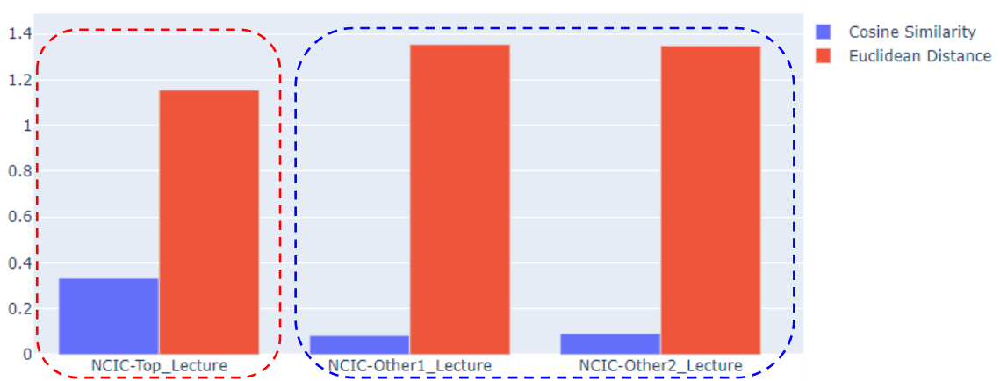
  

## TroubleShooting
### Pose Landmark
-	강의 영상들의 해상도 불일치 : 밀크티 영상의 해상도인 720 프레임으로 통일하여 비교 
-	RDS 적재 : 기존의 [x, y] 형식으로는 적재가 되지 않아 리스트를 풀어서 저장하는 방식을 사용하였으나 시간이 너무 오래 걸려 기존의 코드 전면 수정 후 적재 속도 단축 성공

### GPT API
-	유료 서비스 : Google ID를 여러개 만들어 기본 요금 이내에서 해결
-	사용량 제한 : langchain을 활용해 대용량 언어를 분할하여 명령 전달

### Lambda To ECR
-	S3 트리거 지정이 1개의 람다밖에 되지 않아 람다 내에서 2개의 컨테이너를 실행하도록 코드 변경

### Feature 병렬 구조
-	feature를 병렬 구조로 동시에 데이터를 추출 하여 허비되는 시간을 축소하기 위해 lambda를 통해 병렬구조를 구현 하려고 하였으나 lambda의 경우 실행 시간이 제한되면 라이브러리 사용에도 제한이 있어 aws 컨테이너 배포 시스템 ecs 사용 

### Docker Image Build 
-	Mediapipe 의존성 문제로 인해 Image 생성 시 구현 실패
-	requirements.txt 설치 후 opencv와 Mediapipe 업그레이드를 통해서 해결

### RDS 
-	교육장 내 접근 불가 : Colab 사용, 핫스팟 사용, Docker Image를 ECR에 push 후 ECS에 배포
-	Data 적재 확인 : time package를 활용해 일정시간이 지난 후 데이터 불러올 수 있도록 변경
  

## 고도화 및 추후 개선 방안

### Sentimental
간단한 커스텀 CNN으로 만든 감정 분석 모델의 정확도는 0.54 정도로 비교적 낮은 정확도 수치를 나타내고, 영상 감정 분석시 살짝 느려지는 경향이 있다. 따라서 모델의 정확도와 분석 속도를 향상시키기 위한 여러 방법을 모색해야 한다.

### 모델의 정확도를 향상시키기 위한 방법
-	높은 정확도를 위해서 충분한 양의 다양한 데이터가 필요하다. 더 많은 훈련 데이터를 수집하고, 특히 낮은 정확도로 예측된 클래스에 대한 추가 데이터를 확보하는 것이 도움이 될 수 있다.
-	훈련 데이터에 다양성을 더하는 데 도움이 되는 데이터 증강 기술을 사용한다.
-	학습률, 배치 크기, 에폭 수 등의 하이퍼파라미터를 조정하여 최적의 조합을 찾는다.
### 모델의 분석 속도를 향상시키기 위한 방법
-	모델 압축 기술을 사용하여 모델의 크기를 줄여 추론 속도를 향상시킨다.
-	여러 입력 데이터를 모아서 한번에 모델에 전달하는 배치 인퍼런스를 사용하여 추론 속도를 향상시킨다.
-	병렬 처리를 활용하여 동시에 여러 입력을 처리하도록 모델을 구성한다. 위의 배치 인퍼런스와 결합한다면 더 빠른 속도 향상을 이룰 수 있다.
Pose Landmarker
-	얼굴 부분에서 양 귀의 x, y, z좌표의 변화로 고개가 돌아가는 것도 파악 할수 있을 것으로 보인다.
-	RNN이나 LSTM등을 이용해서 해당 랜드마크 좌표의 움직임을 학습 시켜서 어느 방향으로 고개가 돌아갔는지에 대해서도 알수 있을 것으로 보인다.
-	위의 방법을 사용하여 갤럭시탭과 같이 항상 카메라가 있는 기기를 사용 하여 강의를 듣는 사용자들의 정면 응시률을 구할수 있을 것으로 보인다.
-	얼굴 부분의 랜드마크 검출 비율을 계산하여 실제 사용자가 화면앞에서 강의를 듣고 있는지 강의를 재생 시키고 자리를 비웠는지에 대해서 의무적으로 온라인 강의를 수강해야 하는 여러 분야에서 사용 가능할 것으로 보인다.
-	화면에 얼굴이 있는지 없는지만 검출하는거에 대해서는 더 가벼운 모델이나 매 프레임마다 검출하는 것이 아니라 간격을 두면서 해도 좋을 것으로 보인다. 
  
  

#### 개발 환경 
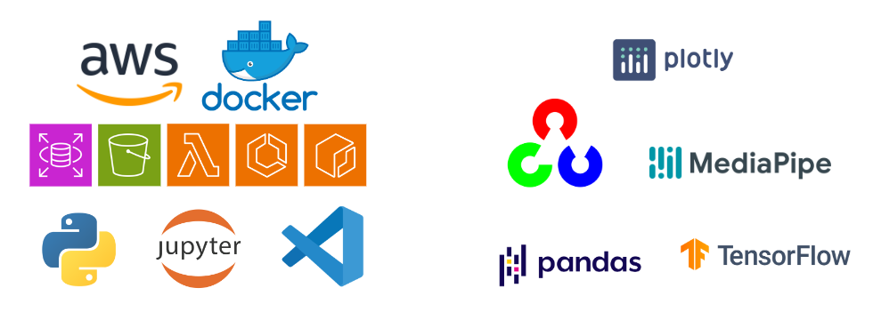
opencv-python (ver.4.8.1.78)
 numpy (ver.1.24.3)
 media pipe (ver.0.10.8)
 boto3 (ver.1.28.77)
 mysql-connector-python (ver.8.2.0)
 pandas (ver.2.0.3)
 seaborn (ver.0.13.0)
 matplotlib (ver.3.7.2)
 tensorflow (ver.2.15.0)
 dash (ver.2.14.2)
 moviepy  (ver.1.0.3)
 nltk (ver.3.8.1)
 plotly (ver.5.18.0)
 scikit_learn (ver.1.3.2)
 scipy (ver.1.11.4)
 SpeechRecognition (ver.3.10.1)
 SQLAlchemy (ver.1.4.50)
 pymysql (ver.1.4.6)
  

#### 참고 
- https://puleugo.tistory.com/17
- https://github.com/googlesamples/mediapipe/tree/main/examples/pose_landmarker/python
- https://developers.google.com/mediapipe/solutions/vision/pose_landmarker/python
- https://www.ncloud.com/product/aiService/clovaSpeech
- https://api.ncloud-docs.com/docs/ai-application-service-clovaspeech-longsentence
- https://developers.naver.com/products/intro/plan/plan.md
- https://openai.com/pricing
- https://platform.openai.com/docs/models
- https://platform.openai.com/docs/guides/speech-to-text

